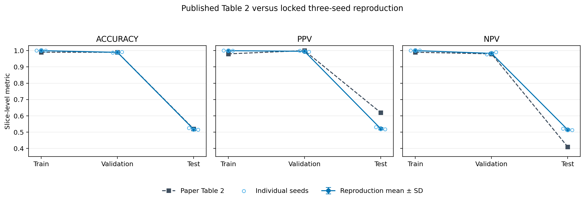
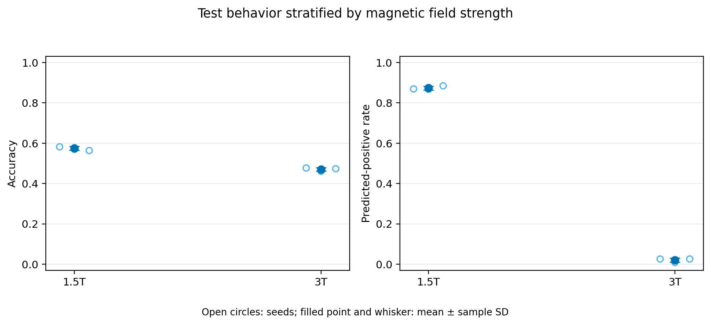
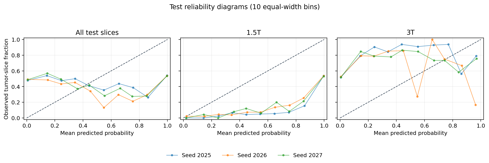

# Final reproduction report

## Scope and protocol

This is a close reproduction of Table 2, **Magnetic Field Strength —
ResNet-50**, from *SpurBreast*. The clinical task is classification of
individual 2D breast-MRI slices as tumor-containing or non-tumor among patients
who already have biopsy-confirmed invasive breast cancer. It is not
patient-level breast-cancer diagnosis.

The official patient-disjoint field-strength split was used unchanged. In
training and validation, tumor slices come from 1.5 T patients and non-tumor
slices come from separate 3 T patients. The test set contains both labels for
every patient and breaks this perfect shortcut. Hyperparameters and checkpoint
selection were locked using validation only. The test set was evaluated once
for each prespecified seed (2025, 2026, and 2027), with a fixed threshold of
0.5 and no post-test changes.

## Primary result

Values are globally pooled slice metrics, reported as mean ± sample SD across
the three locked seeds.

| Split | Metric | Paper | Reproduction | Difference |
|---|---|---:|---:|---:|
| Training | Accuracy | 0.99 | 0.9998 ± 0.0003 | +0.0098 |
| Training | PPV | 0.98 | 0.9995 ± 0.0007 | +0.0195 |
| Training | NPV | 0.99 | 1.0000 ± 0.0000 | +0.0100 |
| Validation | Accuracy | 0.99 | 0.9893 ± 0.0020 | −0.0007 |
| Validation | PPV | 1.00 | 0.9957 ± 0.0032 | −0.0043 |
| Validation | NPV | 0.98 | 0.9831 ± 0.0067 | +0.0031 |
| Test | Accuracy | 0.52 | 0.5175 ± 0.0060 | −0.0025 |
| Test | PPV | 0.62 | 0.5215 ± 0.0073 | −0.0985 |
| Test | NPV | 0.41 | 0.5148 ± 0.0051 | +0.1048 |

The close-reproduction criteria are met for all training/validation metrics,
test accuracy, the validation-to-test accuracy drop (0.4717), and the shortcut
direction. PPV and NPV on test do not match the published row. This was
anticipated: on the released balanced test set, the paper's 0.52 accuracy,
0.62 PPV, and 0.41 NPV cannot all arise from one standard global confusion
matrix. The outcome is therefore a successful close reproduction of the
field-strength shortcut phenomenon, not an exact reproduction of every
reported test metric.

## Shortcut and calibration analysis

On test, the mean predicted-positive rate is 0.8735 at 1.5 T and 0.0200 at
3 T, a gap of 0.8535. Mean field-stratified accuracy is 0.5744 at 1.5 T and
0.4704 at 3 T. The model has therefore retained a very strong field-strength
decision rule even though the unbiased test set breaks its training
correlation.

Calibration also collapses out of distribution. Mean test expected calibration
error is 0.4598 overall, 0.4197 at 1.5 T, and 0.5131 at 3 T (10 equal-width
bins). No calibration method was fitted after observing test results.

Patient-macro test accuracy is 0.5367 ± 0.0054, PPV is 0.5079 ± 0.0154, and
NPV is 0.7205 ± 0.0116. These are explicitly secondary and are not mixed with
the Table 2 slice-micro result. Seed-specific patient-cluster bootstrap
intervals are provided in `reports/final_results/patient_cluster_intervals.csv`.

## Evidence and figures

- `reports/final_results/table2_comparison.csv`: paper, each seed, mean, SD,
  and numerical difference.
- `reports/final_results/field_strength_metrics.csv`: de-identified
  field-stratified metrics.
- `reports/final_results/calibration_bins.csv` and
  `calibration_summary.csv`: de-identified reliability data and ECE.
- `reports/final_results/aggregate_metrics.json`: slice-micro and patient-macro
  seed aggregates with source run names.
- `reports/final_results/table2_comparison.png`: primary comparison.
- `reports/final_results/field_strength_shortcut.png`: shortcut behavior.
- `reports/final_results/test_calibration.png`: reliability diagrams.

Raw per-slice predictions contain patient identifiers and remain ignored on
private Drive storage. No medical images, identifiers, checkpoints, or raw
predictions are published.

## Technical depth and bounded scope

The project goes beyond transfer learning through evidence traceability,
checksum and leakage audits, patient-disjoint protocol enforcement,
validation-only sensitivity analysis, deterministic checkpoint/resume,
multi-seed uncertainty, group-stratified error analysis, and calibration. The
scope stays manageable by using one architecture and one primary shortcut
question. Optional GroupDRO/reweighting and preprocessing extensions are kept
separate from the completed reproduction rather than expanding into
segmentation, deployment, or multiple unrelated model families.

## Conclusion

The ResNet-50 achieves almost perfect in-distribution validation performance
but falls to near-chance test accuracy when the field-strength correlation is
broken. The three seeds agree closely, while their predictions remain strongly
separated by magnetic field strength and severely miscalibrated. This directly
reproduces the paper's scientifically important shortcut-learning claim.
